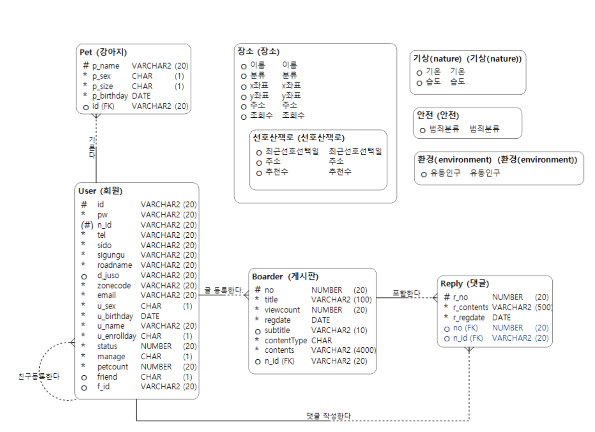
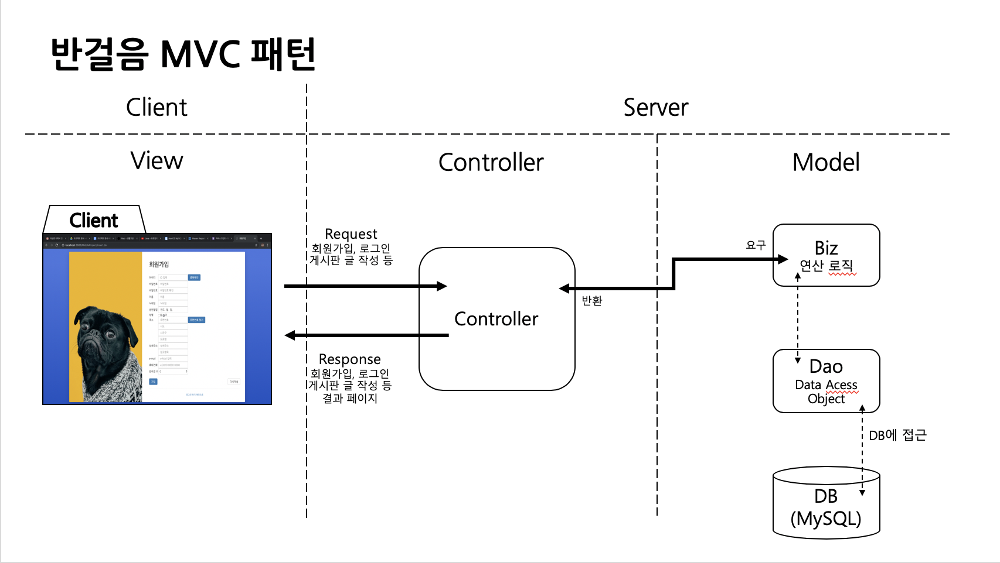

# Banwalk
공공데이터 전국가로수길데이터 활용하여 반려견과 함께 할 수 있는 산책길 제공

## 팀 구성 및 역할
  | 이름 | 역할 |  
  | :------- | :----------- |
  | 김재찬 | PM, DB설계 |  
  | 김성민 | FrontEnd |  
  | 이상준 | BackEnd |
  
## 설계
### 1) DB Diagram  
  
  
### 2) Class Diagram
  [>> 클래스 다이어그램](https://github.com/sangjun1230/Banwalk/tree/master/image/classdiagram)

## 프로젝트 기능
Spring FrameWork 사용 MVC패턴에 입각하여 회원기능과 게시판 기능을 구현

  
  
### 1) 회원가입 및 로그인
  - 회원가입 시 입력되는 회원 정보는 MyBatis를 통해 DB에 적재된다.
  - 로그인 시 입력한 Id, Pw 값을 통해 DB에서 회원 정보를 불러와 세션에 저장한다.

### 2) 산책길
  - DB에 적재된 가로수길 데이터를 불러와 산책길 리스트를 보여준다.
  - 산책길 사진 클릭 시 해당 산책길에 대한 상세 정보와 시작점, 도착점이 포함된 지도를 보여준다.
  
### 3) 커뮤니티(게시판)
  - DB에 적재되어있는 게시판 데이터를 불러와 게시물 리스트를 보여준다.
  - 게시물 작성 페이지를 통해 글을 작성하며 입력된 내용은 DB에 적재된다.
  
### 4) 커뮤니티(사진판)
  - DB에 적재되어있는 사진판 데이터를 불러와 게시물 리스트를 보여준다.
  - 게시물 작성 페이지를 통해 글 작성 및 사진을 업로드하며 입력된 내용은 DB로 사진 파일은 서버에 저장된다.
  - 게시물 사진

## 시스템 구현
|  |  |
| :------------ | :----------- |   
| Development Environment | Mac Os, CentOS |  
| IDE | Eclipse Jee 2018-09 | 
| Front-end | HTML5, CSS3, JavaScript, jQuery, Bootstrap |  
| Back-end | Java 1.8, Spring Framework 4.0 |  
| WAS | tomcat 8.5 |  
| DB | MySQL |  
| library | JSON-simple-1.1.1, log4j2 |  
| Documentation | Google Docs, Object AID, DA# Modeler5 || 
